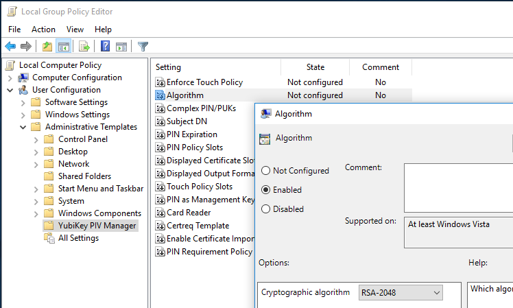
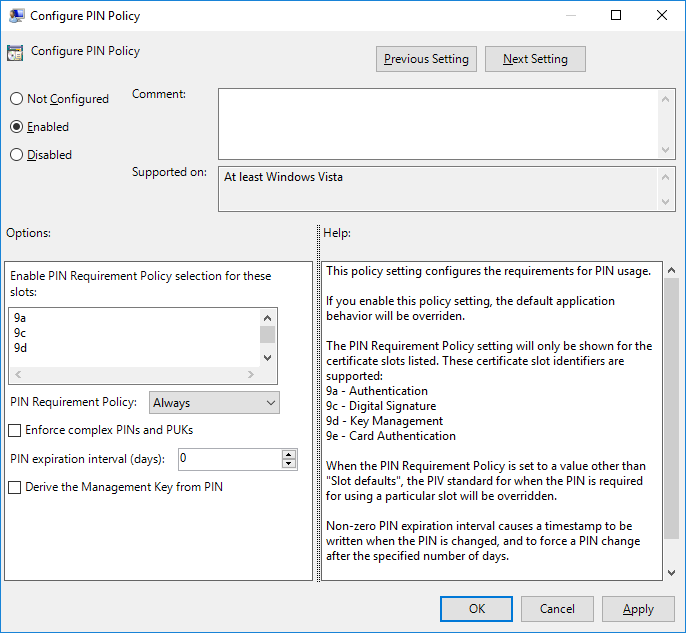

# Administrative Template (ADMX) for YubiKey PIV Manager

> Note: The YubiKey PIV Manager is no longer being maintained. The [YubiKey Manager](https://developers.yubico.com/yubikey-manager-qt/) should be used instead, even though it does not support configuration through registry.

You might also be interested in the [Administrative Template for YubiKey Smart Card Minidriver](https://github.com/MichaelGrafnetter/yubikey-minidriver-admx)

## Introduction

This ADMX administrative template allows administrators to easily deploy configuration of the [YubiKey PIV Manager](https://github.com/Yubico/yubikey-piv-manager) through Active Directory Group Policy. It can also be used on standalone computers to unlock some features of the PIV Manager that are disabled by default, like controlling the Pin and Touch policies.

## Screenshots

## Installation

Just copy the ADMX and ADML files into the [local or central ADMX store](https://msdn.microsoft.com/en-us/library/bb530196.aspx#manageadmxfiles_topic2).

## References

The ADMX template is based on the following official document:

- [YubiKey PIV Manager Settings and Group Policy](https://developers.yubico.com/yubikey-piv-manager/Settings_and_Group_Policy.html)
